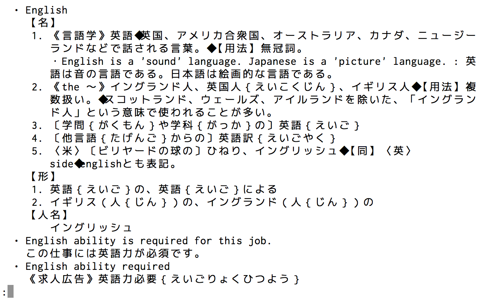
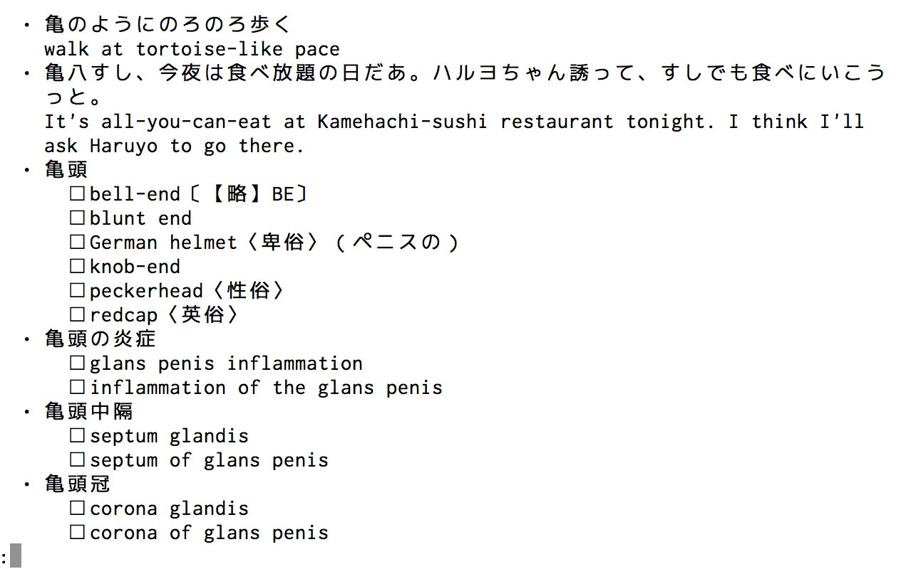

# コマンドライン辞書(ej)

コマンドラインから英辞郎 on the Webの検索結果を見ることができるようにするスクリプトです．**MacOSX**でなるべくインストールするコマンドが無いようにしました．必要なのは**w3m**だけだと思います．

### こちらがオリジナルです
[http://taka.no32.tk/diary/20050826.html](http://taka.no32.tk/diary/20050826.html)

[http://d.hatena.ne.jp/aki-yam/20080629/](http://d.hatena.ne.jp/aki-yam/20080629/)

# インストール
PATHの通っている場所にejをコピーします．

# 使用方法
ターミナルでej englishなどejのあとに調べたい英単語や熟語もしくは日本語を入力します

ej english

ej 亀

